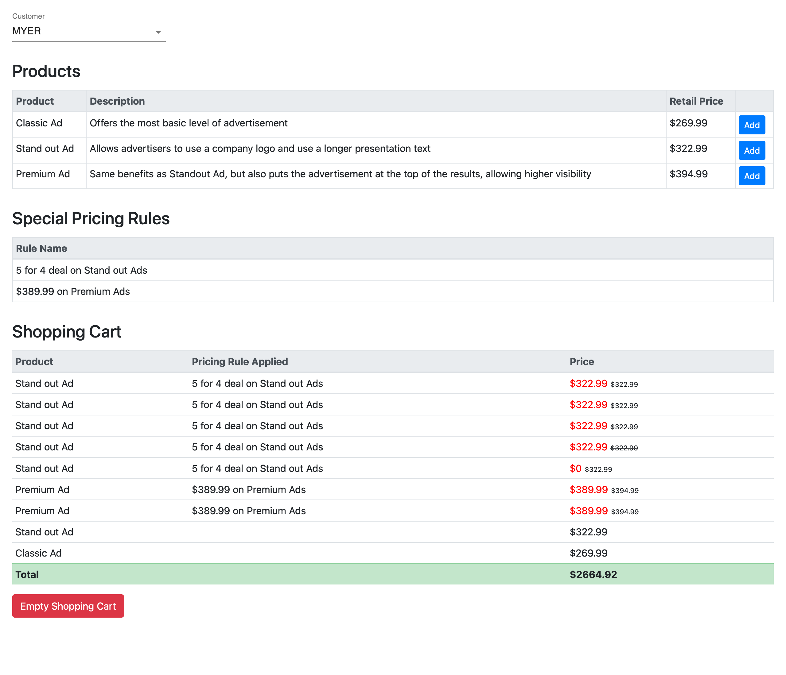

# Pricing Rule React App

The main purpose of this repository is to implement a pricing rule react app that 
could create various pricing rules and apply rules to products in a shopping cart.

## Features
- Flexible in supporting products with different retail price.
- Flexible in creating new pricing rules (inc. rule type), and combining multiple rules.
- Apply rules to the shopping cart automatically, and return the total discounted price.

## Example


## Getting started

### Pre-requisites
- Install [Node.js](https://nodejs.org/en/) version >= 12.16.x
- Install [Yarn](https://yarnpkg.com/getting-started/install)

### Run this project locally
- Clone the repository
```
git clone https://github.com/DavidFengAu/pricing-rules-app.git <project_name>
```
- Install dependencies
```
cd <project_name>
yarn install
```
- Build and run the project
```
yarn start
```

- Open http://localhost:3000

### Deployment
- Build the project for deployment
```
yarn build
```

### Testing
- Run testings in watch mode
```
yarn test
```

## Project Structure
The folder structure of this project is explained below:

| Name | Description |
| ------------------------      | --------------------------------------------------------------------------------------------- |
| **coverage**                  | Contains the code coverage report generated. Run `yarn coverage` |
| **build**                     | Contains the distributable (or output) from your TypeScript build. Run `yarn build` |
| **node_modules**              | Contains all dependencies. Run `yarn install` |
| **src**                       | Contains source code. |
| **src/components**            | React components. |
| **src/models**                | Business models. |
| **src**/App.tsx               | Main panel. |
| **src**/index.tsx             | Entry point. |
| **src/__test__**              | Contains test cases. |
| package.json                  | Contains dependencies as well as [build scripts](#what-if-a-library-isnt-on-definitelytyped). |
| tsconfig.json                 | Config settings for TypeScript compiling. |
| tslint.json                   | Config settings for TSLint code style checking. |

## Available Scripts

| Yarn Script | Description |
| ------------------------- | ------------------------------------------------------------------------------------------------- |
| `start`           | Runs the app locally. |
| `build     `      | Runs full build for deployment. |
| `test`            | Runs testing in watch mode. |
| `coverage`        | Runs testing and create code coverage report. |
| `lint`            | Runs TSLint for code style checking. |

## Contributing
I understand this might not be the perfect project structure and solution.
If you have any ideas, please open an issue and tell me what you think.

If you'd like to contribute, please fork the repository and make changes as you'd like. Pull requests are warmly welcome.

## Useful Links

Here is a list of useful links you might be interested:

- Create react app: https://reactjs.org/docs/create-a-new-react-app.html
- Lodash docs：https://lodash.com/docs/4.17.15
- TS config: https://www.typescriptlang.org/tsconfig
- TSLint config: https://palantir.github.io/tslint/usage/configuration/
